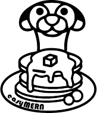
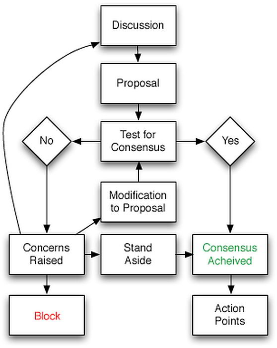

## Mongoose, Express, React, Node stack - ready to go. EasyMern.

This is a simple MERN stack with limited additional libraries, the focus being on rapid deployment for the independent
developer.

[Discord...](https://discord.gg/Sa53aU9fE3)

## The easymern spirit
### Using easymern
- If you use easymern it would be great - but not compulsory - if you could also contribute to making it better.
You can do this through feedback about bugs, helping with documentation, fixing bugs, improving code, simply offering advice.

### Specifically to easymern
- Keep it lean - easymern should use just enough libraries to achieve the goal of being an off the shelf stack that a rookie can pick up, understand and begin coding from.
  - MongoDB, Express, React, Node
  - Role Based Authentication using JWT
  - Basic Frontend with login / logout, some routes.
- Keep it mean - It should be a useful tool to experienced developers to expand on, not a thorn in their side.
- Keep it clean - good coding principles should be used throughout.
  - I did not set a good example to begin with, and I have some tidying up to do (sorry folks!).

### Wishlists

- I have implemented no testing
- Code inconsistency - I learnt form multiple microcourses and tutorials, and you can clearly see the differences in code depending on where I learnt from. These inconsistencies need to be tidied up.
- Better security
  - I don't think this is production ready security
  - I tried to write the custom authentication to allow a user to drop their own auth in (ie Passport) with minimal effort. I don't think it's quite there yet.

# Contributing
## General info
There are two repos with a project each. The frontend and the backend. You can branch and issue a pull request.
To have directional input to help decide what are the features and priorities - I urge you to reach out and join the easymern 'organisation'.
- [The Backend](https://github.com/easymern/be_easymern)
- [The Frontend](https://github.com/easymern/fe_easymern)
- [Discord... for any q's](https://discord.gg/Sa53aU9fE3)

## The team
- JayArghArgh
  - [JayArghArgh (LinkedIn)](https://www.linkedin.com/in/jayarghargh/) <-- message me here to join
  - [My GitHub](https://github.com/jayarghargh)

## Decision Making

I didn't create easymern to be the boss of it, only to have a go-to for a reliable MERN stack.
So right off the bat here's the power to the people. Decisions around easymern should be consensus based using this diagram as guidance.

The Consensus based approach can be as simple as reaching consensus for an idea on the first iteration;
should consensus not be achieved at the early stage, concerns to the proposal are raised and the proposal modified.
This compromise is ongoing until the proposal is either blocked or each team member has committed to a level of personal agreement.

It is expected there may be times when not everyone will agree with the proposals,
the consensus approach gives everyone the opportunity to voice their concerns and to provide varying levels of consent to a decision,
from blocking through to full agreement.

It is important we define early a threshold of approval, which we have agreed will be majority to consent with reservations.
[Source](https://www.plays-in-business.com/consensus-decisioning-how-to-find-minimal-viable-decisions/)

## Support or Contact
Drop me a line with any general questions.
[Discord...](https://discord.gg/Sa53aU9fE3)
Specific issues should be raised via the repository issues after checking the wikis.

# The future
It might be putting the horse before the cart, but definitely in future there's room for additional stacks, and they
don't necessarily have to adhere to each easymern principle. ie - I can see a requirement for a heavy full-featured stack too.
